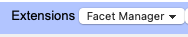
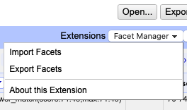

# Facet Manager

This OpenRefine extension provides the user the ability to import and export Facets to/from an OpenRefine project, bypassing the (rather limited) Permalink functionality.

## Status
This extension is provided as-is, without any expectation of ongoing maintenance. Feel free to fork and modify.

## Installation

1. Download the latest release from the Repository homepage on GitHub
2. Copy the .zip file to your OpenRefine extensions folder. Your setup may differ but the default location is likely:
   - Windows: `C:\Users\[User]\AppData\Roaming\OpenRefine\extensions`
   - Linux: `~/.local/share/openrefine/extensions`
   - Mac: `~/Library/Application Support/OpenRefine/extensions`
3. Restart OpenRefine

Before installing the Facet Manager Extension, it's always a good idea to backup your OpenRefine data and any projects you have.

## Usage

The extension assumes you have already created some Facets that you want to export or import into an existing OpenRefine project.

Here's the typical use case: when using very long URLs with OpenRefine's permalink feature, you might encounter an HTTP Error 414 "URI Too Long" (also known as "Request-URI Too Long") error. This is a standard HTTP response status code indicating that the URL exceeds the maximum length that the web server or browser can process.

Most web browsers and servers have limits on URL length for security and technical reasons (e.g. 2083 characters). When the permalink URL exceeds these limits, the browser will return the 414 error rather than process the request.

This Facet Manager Extension allows you to bypass the limitations of the permalink functionality altogether by saving the Facet configuration as a JSON file (upon Export) or importing a JSON file with that configuration (upon Import).

After successful installation, the Facet Manager Extension should be visible in the upper right in the Extensions dropdown box, like so:

When you click its name, a dropdown menu will appear with 3 commands:

If you do not have a JSON file with your wished-for Facets yet, then make sure the Facets have been created in OpenRefine first. Then use the Facet Manager to export those Facets to a JSON File, to be imported the next time you use OpenRefine. A few notes about this may contain:

- The Extension supports Facets of the following types: list, range, timerange, text, and scatterplot facets.
- The maximum configuration JSON file size is 1MB, which should be sufficient in most cases

The exported Facet configuration will be saved as 'facet-config.json'.

If you restart OpenRefine (which typically removes all Facets), you can then use the 'Import Facets' commmand to import your 'facet-config.json' file, which restores the Facets you saved. Because Facets are just a saved 'view' of your data - and do not affect the underlying dataset itself - this will have no impact on your dataset. It does not transform your data in any way.

Nonetheless, it is always a good idea to save a backup of your project before using this Extension.

## Building from Source

1. Clone this repository
2. Run `mvn package` (using Maven)
3. The packaged extension will be in `target/`

## License

*Apache 2.0 License*

The Apache License 2.0 is a permissive open-source software license that allows you to freely use, modify, and distribute the software, even for commercial purposes. It includes key features such as:

- Attribution: You must credit the original authors of the software.
- Modification: You can modify the software, but significant changes must be clearly documented.
- Patent Protection: It provides a grant of patent rights from contributors.
- Redistribution: You can distribute modified or unmodified versions of the software under the same license.

This license ensures flexibility for developers while protecting the original authors and users of the software.
